### About

Passionate AI engineer and open-source developer focused on AI agent development, automation systems, and developer tooling. I build practical solutions that bridge cutting-edge AI and real-world workflows.

### 🔭 Currently working on

### 🚀 Featured projects

### 🛠️ Skills

### 📈 Recent activity

### 📊 GitHub stats

### 🏆 Recent achievements

- Built a mobile interface for the OpenCode AI agent, accessible via GitHub Codespaces
- Created a proxy enabling OpenAI Codex to work with open-weight models
- Developed a comprehensive automation suite for browser and email workflows
- Active contributor to the open-source AI developer-tools ecosystem

### 🤝 Connect

<i>Building the future of AI-assisted development, one open source project at a time.</i>
