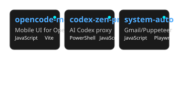

# Marceli

## AI Engineer & Open Source Developer

### About Me
Passionate AI engineer and open source developer specializing in AI agent development, automation systems, and developer tools. I build practical solutions that bridge the gap between cutting-edge AI technologies and real-world applications.

### 🔥 Featured Projects

### 🛠️ Technical Skills

### 📈 GitHub Stats

### 🏆 Recent Achievements
- Built mobile interface for OpenCode AI agent accessible via GitHub Codespaces
- Created proxy enabling OpenAI Codex to work with open models
- Developed comprehensive automation suite for browser and email workflows
- Active contributor to open source AI developer tools ecosystem

### 🤝 Let's Connect
I'm always interested in collaborating on AI projects, automation tools, and open source developer utilities. Feel free to reach out!

*"Building the future of AI-assisted development, one open source project at a time."*
