  

  
    ↳
    <a href="https://github.com/marceli1404/opencode-mobile">opencode-mobile</a> ·
    <a href="https://github.com/marceli1404/codex-zen-proxy">codex-zen-proxy</a> ·
    <a href="https://github.com/marceli1404/prism">prism</a> ·
    <a href="https://github.com/marceli1404/system-automation">system-automation</a> ·
    <a href="https://github.com/marceli1404/SteamDeck-BIOS-Fix">SteamDeck-BIOS-Fix</a>
  

