  

  
  

---

### 🔧 What I work on

- **AI coding agents** — mobile UIs and proxies that make agents like OpenCode and Codex easier to run
- **Automation** — Gmail, calendar, and browser workflows with Playwright &amp; Puppeteer
- **Self-hosting &amp; tooling** — Cloudflare Workers, small CLIs, and dashboards

### 📌 Featured projects

| Project | What it does |
| --- | --- |
| [**opencode-mobile**](https://github.com/marceli1404/opencode-mobile) | Mobile web UI to use the OpenCode AI agent from your phone via GitHub Codespaces |
| [**codex-zen-proxy**](https://github.com/marceli1404/codex-zen-proxy) | Run OpenAI Codex (CLI/desktop) on OpenCode Zen models through a local proxy |
| [**prism**](https://github.com/marceli1404/prism) | GitHub pull-request dashboard with device-flow auth on a Cloudflare Worker |
| [**system-automation**](https://github.com/marceli1404/system-automation) | Gmail + Playwright/Puppeteer automation toolkit |
| [**SteamDeck-BIOS-Fix**](https://github.com/marceli1404/SteamDeck-BIOS-Fix) | Fixes BIOS-manager download failures on the Steam Deck |

### 🛠️ Tech I reach for

  
  
  
  
  
  
  
  
  
  

📍 Edinburgh, Scotland · exploring AI workflows, automation, and self-hosting
